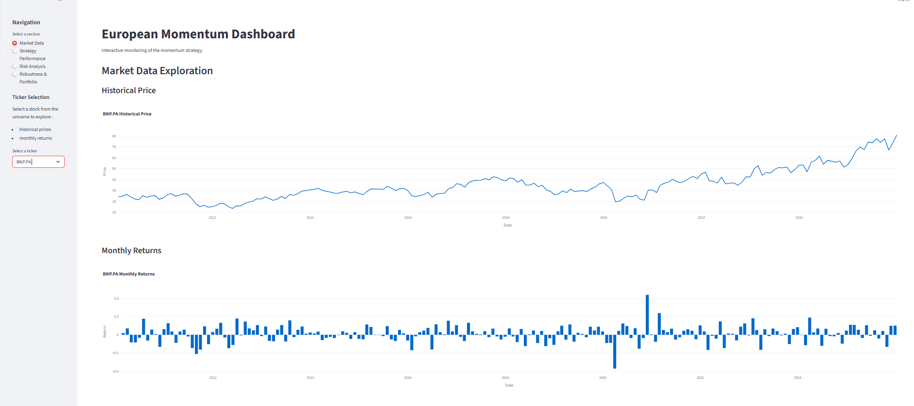
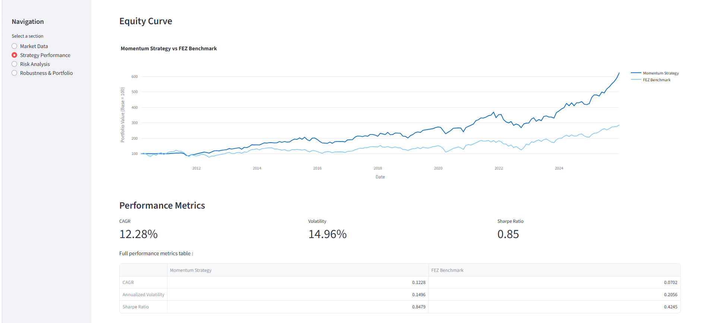
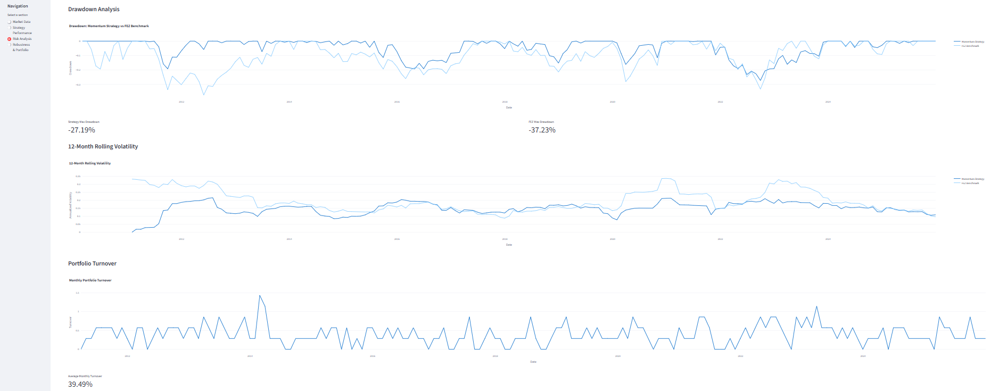
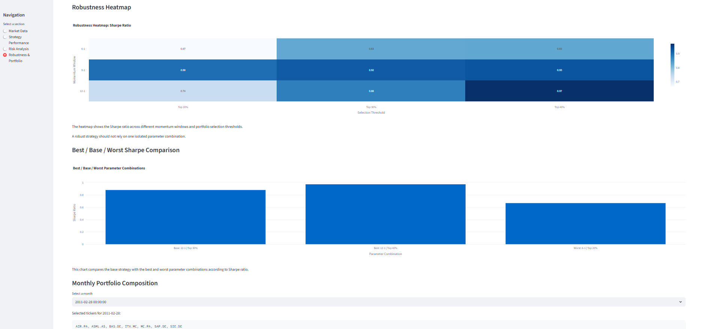

# Market Dashboard

[Live Dashboard](https://europe-momentum-dashboard.streamlit.app)

---
## Objective

This project transforms the results of the Europe Momentum Backtest project into an interactive financial dashboard.

The objective is to provide a user-friendly interface for exploring the momentum strategy, analyzing its performance, evaluating its risk profile, and investigating its robustness across different parameter choices.

The dashboard is built with Streamlit and Plotly and allows dynamic exploration of both market data and portfolio results.

---

## Features

### Market Data Exploration

- Interactive ticker selection
- Historical price visualization
- Monthly returns visualization
- Dynamic Plotly charts

### Strategy Performance

- Momentum strategy equity curve
- FEZ benchmark comparison
- Performance metrics dashboard
- CAGR, volatility and Sharpe ratio indicators

### Risk Analysis

- Drawdown analysis
- 12-month rolling volatility
- Portfolio turnover monitoring
- Gross vs net performance comparison
- Transaction cost impact assessment

### Robustness & Portfolio Exploration

- Robustness heatmap across momentum windows and selection thresholds
- Best / base / worst parameter comparison
- Monthly portfolio composition exploration
- Dynamic ticker selection by date

---

## Strategy Overview

The dashboard is based on a systematic momentum strategy developed in the Europe Momentum Backtest project.

### Main Strategy Rules

- Universe: 24 European large-cap equities
- Momentum signal: 12-1 momentum
- Selection: Top 30% ranked stocks
- Weighting: Equal weight
- Rebalancing: Monthly
- Transaction costs: 10 bps per trade

### Benchmark

- FEZ ETF (Euro Stoxx 50 ETF)

---

## Project Structure

```text
market_dashboard/
│
├── app/
│   └── dashboard.py
│
├── data/
│   ├── monthly_prices.csv
│   ├── monthly_returns.csv
│   ├── backtest_summary.csv
│   ├── performance_metrics.csv
│   ├── transaction_costs_summary.csv
│   └── robustness_grid.csv
│
├── notebooks/
│
├── src/
│   ├── data_loader.py
│   └── charts.py
│
├── README.md
└── requirements.txt
```
---

## Installation

```bash
pip install -r requirements.txt
```

---

## Launch Dashboard

```bash
streamlit run app/dashboard.py
```

---

## Dashboard Sections

### Market Data

Explore historical prices and monthly returns for all stocks in the investment universe.

### Strategy Performance

Compare the momentum strategy against the FEZ benchmark and analyze key performance metrics.

### Risk Analysis

Evaluate drawdowns, volatility, turnover and transaction cost impact.

### Robustness & Portfolio Exploration

Evaluate the robustness of the momentum strategy across:

- Momentum windows: 6-1, 9-1 and 12-1
- Selection thresholds: Top 20%, Top 30% and Top 40%

The dashboard also allows users to explore the portfolio composition through time and identify which stocks were held at each monthly rebalance date.

---

## Technologies

- Python
- Streamlit
- Plotly
- Pandas
- NumPy
- Matplotlib

---

## Dashboard Preview

### Market Data



### Strategy Performance



### Risk Analysis



### Robustness & Portfolio

